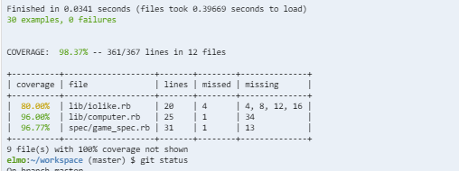

[](https://codeclimate.com/github/elenamorton/cli-tic-tac-toe)


# Tic Tac Toe Game - console (CLI) version

## 1. Usage Instructions
* clone the repo and install the Ruby gems
```sh
$ git clone https://github.com/elenamorton/cli-tic-tac-toe.git
$ cd cli-tic-tac-toe
$ bundle install
```
* run tests
```sh
$ rspec
```
* test coverage



* run the CLI application.
> We have to make sure the script is marked as executable. If it is not, please run the command `chmod +x app.rb`
```sh
$ ./app.rb
```

#### Used Technologies
* ruby 2.3.4p301
* rspec (3.6.0)
* simplecov (0.15.0)

## 2. Specification

### Headline specifications
* Allow the user to choose the level of difficulty (“easy” means the computer can easily be beaten, “medium” means it can be beaten but only with a series of intelligent moves, and “hard” means the it is unbeatable).
* Allow the user to choose the game type (human v. human, computer v. computer, human v. computer).
* Allow the user to choose which player goes first.
* Allow the user to choose with what "symbol" the players will mark their selections on the board (traditionally it's "X" and "O")

### User Stories extracted from the specification

```
As a user
So as I can have a nice time
I'd like to be able to play tic-tac-toe game

As a user
So as I can decide on computer play level
I'd like to see the options available

As a user
So as I can make a choice the computer play level
I'd like to be able to select it

As a user
So as I can make a choice about the players
I'd like to be able to select the players type

As a user
So as I can make a choice about the players order
I'd like to be able to select the which players starts first

As a user
So as I can see the players moves on the game board
I'd like to be able to select the players symbols they mark their moves
```

## 3. Application design

### Asumptions
* The user is providing all the game setup information at the start of game, via console inputs, answering to the questions printed on the screen.
* The user is not choosing the same symbol marker for both players.
* The user is inputting all the moves, each at a time, for any 'Human' player.

### Design Decisions
The current design contains five classes `Game, Board, Scorer, Human`, and `Computer`,  and an IO module `IOlike`.
The design tries to follow SOLID principles, each class having single responsibility (athough `game` is more fat), DRY code, 
creating loose class dependencies by dependency injections (`game` injects `scorer` object to each `player` objects). 
Encapsulation is served by hidding the `board` and `score` tables inside their own objects, everyone communicating with these objects receiving copies of the tables to use.
Duck-typing is achieved by unifying the `human` and `computer` players behaviour, publishing a common API method for both: `move = @current_player.get_next_move(@valid_moves)`

* The main class is the `Game` class, that is containing all the game configuration data, creates all required objects based on game setup data, and handles the game flow.
This class is intantiated by the application script `app.rb`.
* The `Board` class is instantiated when a `Game` is started and updated by the `game` object after each player makes a valid move. The `board` default width is `3`, but it can be set by `game` to any other number.
The `board` instance variable is set up an as array of ordered strings, starting `'0'` up to `width**2`. Each value string is the `i.to_s` array position. 
The actual `board` is never seen by the `game`, this always receives a copy of the `board` for handling. The `board` variable instance is updating by `board` object with the symbol a player has used for its move, by calling `@board_play.place_marker(marker, spot)`.
* The `Scorer` class is handling the game score. It is the instantiated when a `Game` is started, and updated by the `game` object after each player makes a valid move in the `post_move_updates` by calling `@scorer.calculate_score(spot, marker)`.
The `scorer` object is independent on the players symbols. It is only setup one with value `+1` and the other with `-1` for calculating a move score. 
A `score_table` is a hash table with 8 elements for a '3 x 3' grid. It contains a key for each row, coloumn, diagonal, and anti-diagonal such as `{:D=>-1, :antiD=>-3, :R0=>0, :R1=>0, :R2=>-1, :C0=>0, :C1=>0, :C2=>-1}`
A `score_table` copy is used by the `computer` player for calculating its next best move. Although, not fully implemented at this moment, only the basic support is provided.
A `win` happens when any absolute value in the `@score_table` is equal `3.`
* The `Human` class is instantiated by the `game` after the user chooses the players type. It can be instantiated once in a `human v. computer` game, or twice in a `human v. human` game.
Each instance is injected a `scorer` dependency for future support of difficulty play levels used by `computer`.
* The `Computer` class
* The `IOlike` module is handling all the input/output operations required by the `game`, `human` player, or `rspec` tests. Additionally, the `get_input` message handles gracefully a bad user input, by reprinting the message with expected input until user introduces the correct input. 

#### Class diagram

#### Objects creation
* _Game_ class instantiation
```ruby
game = Game.new
game.start_game
```
* _Board_ class instantiation
```ruby
@board_play = Board.new(@width)
@board = @board_play.board
```
* _Scorer_ class instantiation 
```ruby
@scorer = Scorer.new({:width => @width, :x_marker => X_MARKER, :o_marker => O_MARKER})
```
* _Human_ class instantiation
```ruby
@players[] = Human.new(outgoing, incoming, {:width => @width, :marker => marker, :scorer => @scorer})
```
* _Computer_ class instantiation 
```ruby
@players[] = Computer.new({:width => @width, :marker => marker, :scorer => @scorer, :depth => 0})
```
* _Current and opposing players_ are selected based on user input choice
```ruby
  def setup_players_order
    player = get_input("Please, choose which players goes first (1|2)", /\A1|2\z/)
    @current_player, @opposing_player = player_1, player_2 if player == '1'
    @current_player, @opposing_player = player_2, player_1 if player == '2'
  end
```

### Current Limitations
The computer difficulty level is not currently implemented in the Computer class. The current implementation is a 'easy' level. The compuer player is practically choosing the next move randomly from a valid moves array.
Please, see the 'Future extensions' section for implementation suggestions.

```ruby
  def get_best_move(valid_moves, depth, best_score = {})
    score_table_copy = @scorer.score_table.dup
    valid_moves.each do |move|
      @scorer.calculate_score(score_table_copy, move, @marker)
      if @scorer.win?
        return move
      else
        @scorer.calculate_score(score_table_copy, move, @marker)
        if @scorer.win?
          return move
        end
      end
    end
    valid_moves.sample
  end
```

### Output of a game play between two Computer players:

```sh
$ ./app.rb
Please, choose a player (human|computer): computer
Please, choose another player (human|computer): computer
Please, choose a player symbol (X|other letter): 7
You've entered 7, which is invalid
Please, choose a player symbol (X|other letter): o
Please, choose the other player symbol (O|other letter): z
Please, choose the difficulty level (easy|medium|hard): easy
Please, choose which players goes first (1|2): 1
 0 | 1 | 2 
===+===+===
 3 | 4 | 5 
===+===+===
 6 | 7 | 8 
 0 | 1 | 2 
===+===+===
 3 | O | 5 
===+===+===
 6 | 7 | 8 
 0 | 1 | 2 
===+===+===
 3 | O | 5 
===+===+===
 6 | Z | 8 
 0 | 1 | 2 
===+===+===
 3 | O | O 
===+===+===
 6 | Z | 8 
 Z | 1 | 2 
===+===+===
 3 | O | O 
===+===+===
 6 | Z | 8 
 Z | 1 | O 
===+===+===
 3 | O | O 
===+===+===
 6 | Z | 8 
 Z | 1 | O 
===+===+===
 Z | O | O 
===+===+===
 6 | Z | 8 
 Z | 1 | O 
===+===+===
 Z | O | O 
===+===+===
 6 | Z | O 
Game over
```
## 4. Future extensions

### Computer difficulty level implementation
### Display of the game results (win/tie)
### Game setup using a configuration file
### Improve game output layout
